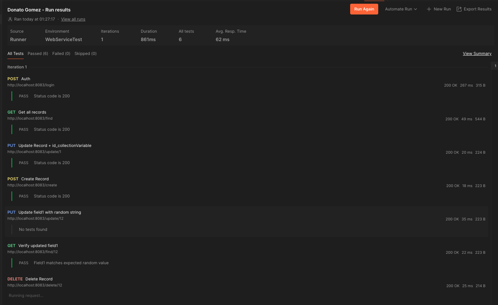

# 🧪 Práctica Postman & Pre-Request / Post-Response con Runner

> Autor: **Donato Gómez**  
Perfil: iOS Developer · Swift · SwiftUI · Git Avanzado · Postman
Repositorio: https://github.com/donatogomez/postman-runner-practica-donato-gomez

## 📂 Estructura del proyecto

```plaintext
postman-practica-donato-gomez/
├── 📁 collections/
│   └── DonatoGomez.postman_collection.json
├── 📁 environments/
│   └── DonatoGomez.postman_environment.json
├── 📁 screenshots/
│   └── runner.png
└── 📄 README.md
└── 📄 LICENSE.txt
```

## ✅ Objetivo

Automatizar una colección de Postman ejecutada con Runner, aplicando el uso de variables, scripts Pre-request/Test, y peticiones encadenadas para simular un flujo completo de API RESTful.

## 🧭 Pasos realizados

### 1. 🔐 Autenticación
- Se realiza login y se guarda el `accessToken` como **variable de entorno**.

### 2. 📥 Obtener todos los registros
- Se lanza la petición GET con el token.
- Se guarda el primer `id` recibido en una **variable de colección** llamada `id_collectionVariable`.

### 3. 📝 Modificar un registro completo
- Se modifica el registro con `id_collectionVariable`.
- Se actualizan los campos `field1` y `field2`.

### 4. ➕ Crear nuevo registro
- Se crea un nuevo recurso.
- Se verifica el código de respuesta HTTP esperado.
- Se guarda el nuevo `id` como **variable global** `id_globalVariable`.

### 5. ✏️ Modificar solo `field1`
- Se utiliza `id_globalVariable` para apuntar al registro.
- El nuevo valor de `field1` se genera con la función de Postman:  
  `pm.variables.replaceIn("{{$randomAlphaNumeric}}")`
- Se guarda este nuevo valor en la **variable global** `field1_variable`.

### 6. 🔎 Verificar valor modificado
- Se consulta el registro con `id_globalVariable`.
- Se comprueba que `field1` coincide con `field1_variable`.

### 7. ❌ Eliminar un registro
- En el bloque **Pre-request**, se hace una llamada interna para obtener un `id`.
- Se guarda como `id_globalVariable`.
- Se ejecuta la petición DELETE usando ese `id`.
- Se valida la respuesta conteniendo:
  - Campo `ResponseMessage`.
  - Valor: `"Record deleted successfully"`.

## 🏃‍♂️ Ejecución con Runner

- Se ha configurado **1 iteración**.
- Todas las variables se gestionan automáticamente a lo largo del flujo.

## 📸 Captura:


## 🪪 Licencia

Distribuido bajo licencia MIT.  
Uso libre con atribución.
